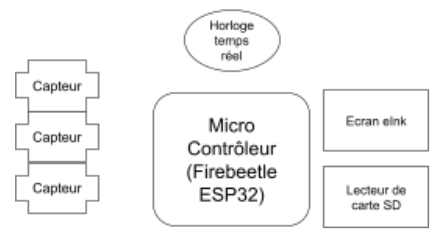
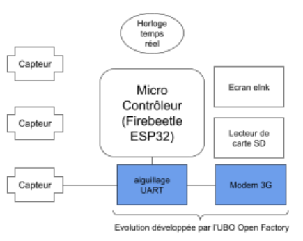
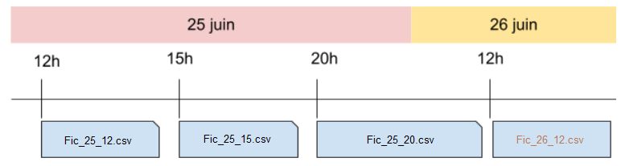
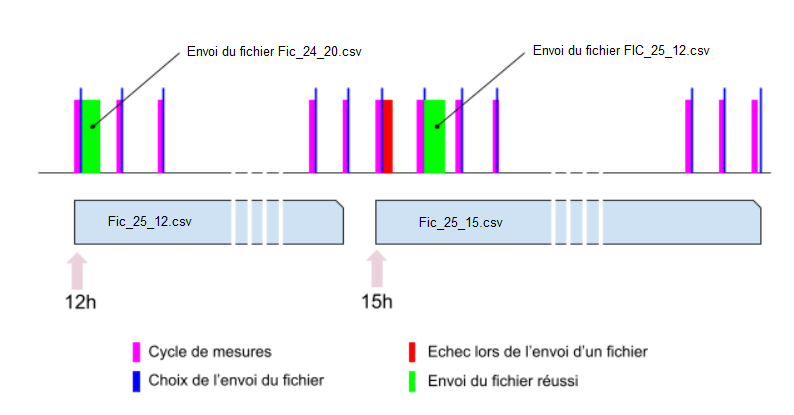

# Datalog-SousMarin-3G
<H1>Data logger sous marin a transmission de compte rendu par 3G</H1>

Ce montage électronique se greffe sur un système existant qui réalise des mesures quelconques et les enregistre sur une carte SD.  
L'apport de ce système est de : 
<ul>
<li>regrouper les données dans des fichiers séquentiels paramétrables</li>
<li>envoyer ces fichiers en FTP (3G) vers un centre de données</li>
</ul>

Il permet l'exploitation des données dans un délais beaucoup plus court que celui nécessaire à le récupération des informations stockées sur la carte SD.  

<H2>Système existant / Apport </H2>
Le système présenté ci-dessous est un système quelconque dont seul le synoptique est présenté afin de comprendre les modifications à y apporter pour greffer le logger.  
<H3>Système initial avant adjoction du transmetteur 3G</h3>

<H3>Système après adjonction du transmetteur 3G</h3>

<H2>Répartition des mesures dans les fichiers de sauvegarde </H2>
Les données mesurées sont enregistrées dans des fichiers sur la carte SD. Ces fichiers contiennent les données d'une période définie entre 2 heures de la journée (ou de la journée précédente ou de la journée suivante).  
Ces périodes sont programmabele via la variable "" du fichier de configuration "".  
Le graphique ci-dessous donne la répartition des fichiers sur 2 journées consécutives avec une scission des données à 12h, 15h et 20h (soit 3 fichiers différents au lieu du fichier journalier).  
Dans un souci d’organisation et de planification d’écriture des données, un fichier est ouvert au début d’une période et clôt à l'issue de cette période.  
Exemple : le fichier fic_25_15 est considéré ouvert à 15h le 25 et clos avant 20h le 25.   

<H2>Développement d’un outil de décision pour sécuriser l'envoi des données.</H2>
Nous avons développé un outil de décision qui a pour objectif de définir à quel moment un fichier de données doit être envoyé.

L’outil de décision obéit à plusieurs règles pour envoyer un fichier. Pour envoyer un fichier :
<ul>
	<li>Le fichier de données doit être clos (cf. ci-dessus).</li>
	<li>Le fichier ne doit pas avoir été précédemment envoyé (test de l’accusé de réception du dernier envoi). </li>
	<li>Le précédent envoi sur le même fichier a échoué. Il y a alors au moins 4 tentatives d’envoie et au maximum 4 tentatives par heure.</li>
	<li>Il n’y a pas de fichier plus récent à envoyer</li>
</ul>

Exemple : si à 20h le fichier de 12h n’a pas pu être envoyé, l’outil de décision ne fera pas de tentative d’envoi. Ainsi, seul le fichier de 15h pourra être envoyé  

Le graphique ci-dessous illustre les différentes règles auxquelles obéit l’outil de décision :   

<H2>Envoi du fichier</H2>
Lorsqu’un fichier doit être envoyé (à la fin de chaque phase bleue ci-dessus) , le microcontrôleur entame la procédure d’envoi suivante :  
<ul>
<li>réveil et initialisation du module GSM 3G</li>
<li>configuration du module (réseau, FTP…)</li>
<li>envoi des données</li>
<li>Reception de l’accusé de réception</li>
<li>Enregistrement de l’accusé de réception</li>
<li>Extinction du module GSM 3G.</li>
</ul>

<H2>Algorithme</H2>

<ul>
	<li><a href="Production/Programmation/V1/algorithmes/V1.0_ stable emission avec simulation de mesures.pdf" target="_blank">V1.0_ stable emission avec simulation de mesures</a></li>
	<ul>
		<li>Titre</li>
	</ul>

</ul>

     
